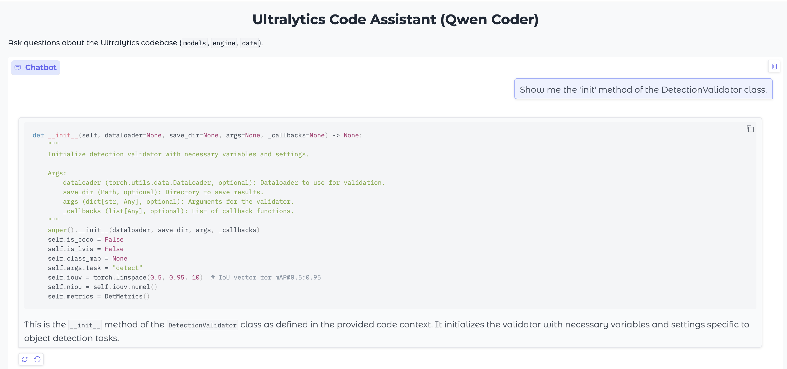
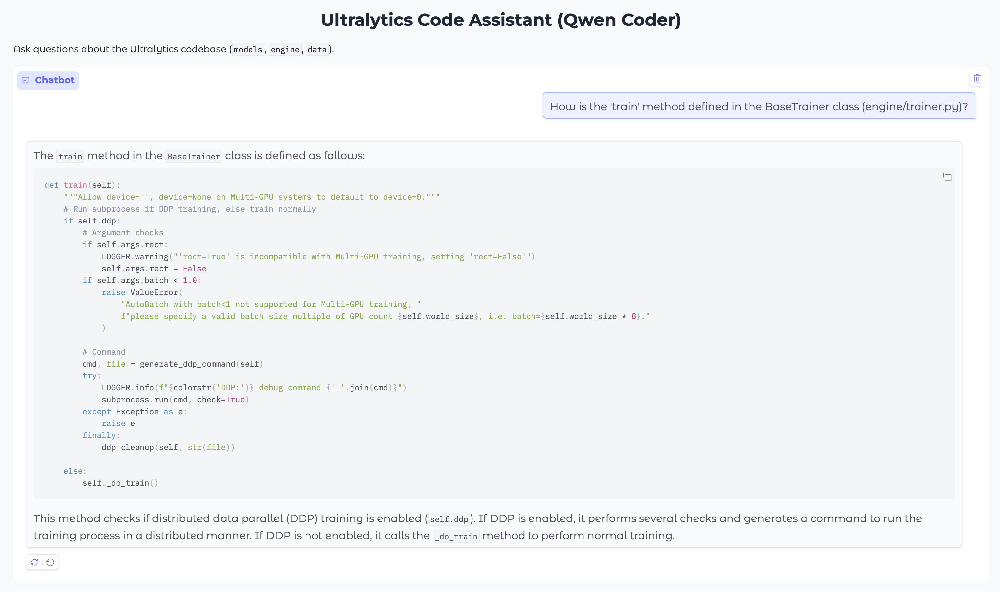
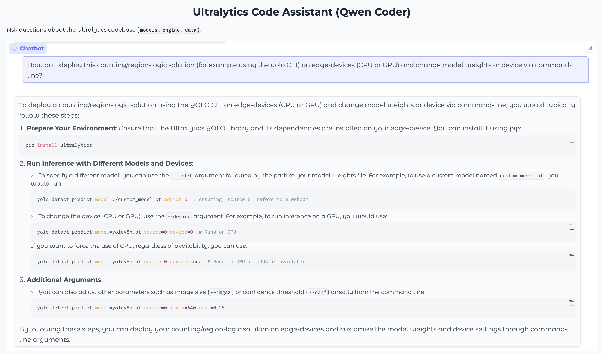
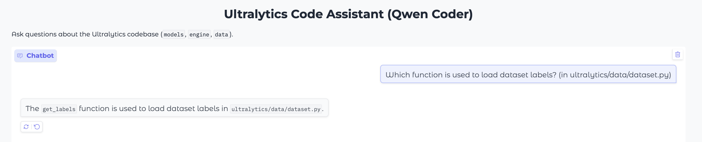
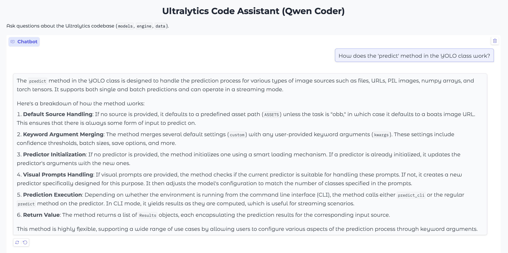

# Code Assistant with Mongo DB based RAG pipeline.

This project is a simple **RAG (Retrieval-Augmented Generation)** code assistant built to answer questions about the **Ultralytics YOLO Python source code**, specifically the `models`, `engine`, and `data` directories.

This version runs the **Qwen/Qwen2.5-Coder-7B-Instruct** model locally on your own NVIDIA GPU.

---

## 🚀 Core Features

- **Chat Interface** — Simple Q&A using Gradio  
- **Code Indexing** — Processes `.py` files from the `ultralytics/` directory  
- **Vector Search** — Uses MongoDB Atlas for storing and searching code chunks  
- **Answer Generation** — Run the Qwen-Coder model locally  

---

## ⚙️ Hardware Requirements

Running a 7B parameter model on specific hardware.

- **GPU:** NVIDIA GPU 
- **VRAM:** At least 24 GB recommended  
- **CUDA:** Proper CUDA drivers compatible with torch versions  

---

## 🧩 Setup and Running

### 1. MongoDB Atlas Setup

1. Create a free (M0) account at **[MongoDB Atlas](https://www.mongodb.com/atlas)**.  
2. Create a new **Database** (e.g., `yolo_code_db`) and a **Collection** (e.g., `code_chunks`).  
3. Create a **Vector Search Index**:

   - Navigate to your `code_chunks` collection → **Search Indexes** tab.  
   - Click **Create Search Index → JSON Editor**.  
   - Use **vector_index** as the Index Name and paste the following configuration (for 768-dimension Jina embeddings):

```json
{
  "mappings": {
    "dynamic": false,
    "fields": {
      "embedding": {
        "dimensions": 768,
        "similarity": "cosine",
        "type": "knnVector"
      }
    }
  }
}
```

---

### 2. Project Setup

```bash
uv venv
source .venv/bin/activate
uv sync

```

---

### 3. Environment Variables

Copy the example environment file and update it:

```bash
cp .env.example .env
# Edit .env and add your MONGO_URI
```

`.env` file should contain:

```bash
MONGO_URI="mongodb+srv://<your_username>:<your_password>@<your_cluster_address>/"
```

---

### 4. Index the Code (Silent Mode) and Launch the Application

This script processes the YOLO codebase and uploads it to MongoDB Atlas. 
Once indexing is complete, start the Gradio app:

```bash
sh app_run.sh
```

When you run this, your console will display logs and loads the model onto your GPU.  
Once loading completes, the interface will be available at:

👉 [http://127.0.0.1:7860](http://127.0.0.1:7860)

## Example of Use Cases
### Case 1


---

### Case 2


---

### Case 3


---

### Case 4


---

### Case 5


---

## Design Notes
### How I chunk code (and why)?
I created two main types of chunks:
1. Class Chunks:
   - What: The entire body of a class.
   - Why: Gives the LLM high-level, structural context. (e.g., "What does this component do?")

2. Function/Method Chunks:
   - What: A single function or a single class method.
   - Why: Provides precise, actionable code. This matches how developers ask questions. (e.g., "Show me how train() works?")

Why This Works:
- Syntactic Safety: AST boundaries stop us from cutting code mid-line. The LLM always gets valid code.
- Developer Focus: The chunks align with how a developer thinks about and searches a codebase.

Current Limits:
- Missing Context: I don't chunk imports, constants, or module docstrings at the top of a file.
- Nested Scope: I don't track the full path for functions defined inside other functions.

### What metadata extracted?
Each chunk stores:
* file_path: absolute/relative path inside code-repo/ultralytics/…
* type: "class" or "function"
* name: symbol name (e.g., YOLO, train, predict)
* lineno: first line of the node (1-based)
* code_snippet: exact code between lineno and end_lineno
* embedding: 768-d vector
* content_for_llm: the assembled text which is passed to the LLM

### Embedding model (choice & rationale)
* Model: jinaai/jina-embeddings-v2-base-code (768 dims)
* Rationale: strong code retrieval performance, multilingual/code-aware training, permissive license, easy sentence_transformers drop-in.
* Config: I set max_seq_length=8192 to avoid truncation on larger classes.

### LLM (choice & rationale)
* Current: Qwen/Qwen2.5-Coder-7B-Instruct run locally with transformers (device_map="auto", torch_dtype="auto").
* Rationale: good code reasoning for its size, permissive license, easy on a single modern NVIDIA GPU, deterministic local stack.
* Prompting: A strict system prompt instructs the model to answer only from provided context. I concatenate the top-k chunks (k=3) with clear separators and ask the model to cite only what’s in context or admit when missing.

### Vector search design
* Store: MongoDB Atlas
* Index: single knnVector field (embedding, 768 dims, cosine).
* Query: $vectorSearch with numCandidates=100, limit=k.
* Returned fields: content_for_llm and the similarity score (for debugging or future re-ranking).

### Trade-offs I made
* AST-only chunking vs. fancy heuristics: AST is robust and simple; I skipped comment/docstring folding, decorator capture, and import-hoisting to keep indexing fast and deterministic.
* k=3 context windows: Small k reduces hallucinations and token costs, but rare answers might live in a 4th/5th relevant chunk.
* No re-ranking: I relied solely on vector similarity; no re-ranker to keep latency low.
* 7B vs. larger models: Larger models would likely improve reasoning but add cost, network latency, and dependency on third-party uptime so used small model.
* Single collection: I keep all chunks in one collection for simplicity; per-module sharding or multi-index layouts could help at scale.

### Future Work
* Implement vLLM for faster inference.
* Larger Modal selection like Qwen/Qwen3-Coder-30B-A3B-Instruct-FP8.
* Hybrid retrieval.
* Cross-encoder re-ranker: Re-rank top-20 with a small bi-encoder/cross-encoder for big answer-quality gains.
* Increase k to catch relevant chunks.
* Richer chunk metadata:
    * Capture decorators, imports, module docstrings, and class inheritance.
    * Add a qualified_name like ultralytics.engine.trainer.BaseTrainer.train.
    * Store end_lineno and sha to detect drift across repo versions.
